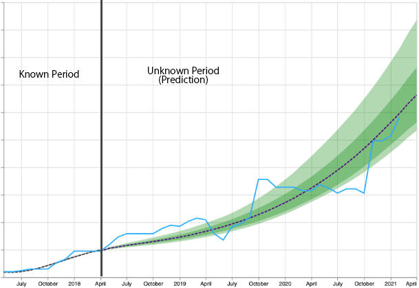

<div align="center">


**Simulation-informed Revenue Extrapolation (SiRE) with confidence estimate for scaleup companies using scarce timeseries data.**

------

<p align="center">
  <a href="#overview">Overview</a> •
  <a href="#usage">Usage</a> •
  <a href="#example-forecast">Example</a> •
  <a href="https://arxiv.org/abs/2208.10375">Arxiv</a> •
  <a href="#cite-this-work">Citation</a> 
</p>

</div>

[](https://github.com/EQTPartners/sire/releases/tag/0.0.1)
[](https://www.cikm2022.org/)
[](https://www.python.org/doc/versions/)
[](https://eqtgroup.com/motherbrain)


## Overview
Investment professionals rely on extrapolating company revenue into the future (i.e. revenue forecast) to approximate the valuation of scaleups (private companies in a high-growth stage) and inform their investment decision. This task is manual and empirical, leaving the forecast quality heavily dependent on the investment professionals’ experiences and insights. Furthermore, financial data on scaleups is typically proprietary, costly and scarce, ruling out the wide adoption of data-driven approaches. 

We propose an algorithm **SiRE (Simulation-informed Revenue Extrapolation)** that generates fine-grained long-term revenue predictions on small datasets and short time-series.
SiRE fulfills eight important practical requirements: 
1. it performs well in multiple business sectors;
2. it works on small datasets with only a few hundred scaleups; 
3. the extrapolation can commence from short revenue time-series; 
4. it should produce a fine-grained time-series of at least three-year length; 
5. each predicted revenue point should come with a confidence estimation; 
6. it does not require any alternative data other than sector information;
7. the model can be timely and effortlessly adapted to any data change. 
8. the prediction is explainable.

## Usage

The source code and two datasets (transformed and anonymized) are already bundled in this repo. 
To run SiRE on both datasets, follow the steps below.

- To isolate the Python runtime for SiRE experimentation, install a virtual environment such as [Anaconda](https://www.anaconda.com/). We hereby assume that you are using Anaconda. The following steps should be run in the project folder `sire` from a Terminal.

- Create a virtual Python environment by running:
```bash
$ conda create --name sire python=3.8
$ conda activate sire
```

- Install the dependent libraries:
```bash
$ pip install -r requirements.txt
```

- Start Python Notebook:
```bash
$ jupyter notebook
```

To experiment SiRE on [SapiQ](data/sapiq.json) dataset, run through the notebook named [`sire_sapiq.ipynb`](sire_sapiq.ipynb).

To experiment SiRE on [ARR129](data/arr129.json) dataset, run through the notebook named [`sire_arr129.ipynb`](sire_arr129.ipynb).

## Example Forecast

Following is the forecast (from 2018-05-01) visualization for company in ARR129 with ID `5cf74ff84639c79510ef8491d4725967336ad3627216a50553f030f9c51d93bc`.



The corresponding predicted revenue points with 95% confidence interval (`95CI`) look like below.
| DATE     |   MEAN |   `95CI`_low |   `95CI`_high |   MIN |   MAX |
|:--------------------|---------------:|-------------------------:|-------------------------:|--------------:|--------------:|
| 2018-05-01 |        52.6052 |                  51.6823 |                  53.5282 |       50.6054 |       54.8298 |
| 2018-06-01 |        55.3628 |                  54.0489 |                  56.6767 |       52.6138 |       58.5401 |
| 2018-07-01 |        57.8639 |                  56.1423 |                  59.5856 |       54.3638 |       62.0497 |
| 2018-08-01 |        60.2249 |                  58.0926 |                  62.3571 |       55.9818 |       65.4445 |
| 2018-09-01 |        62.5506 |                  60.0036 |                  65.0977 |       57.5778 |       68.819  |
| 2018-10-01 |        64.9284 |                  61.9523 |                  67.9044 |       59.2417 |       72.2662 |
| ... |        ... |                  ... |                  ... |       ... |       ... |
| 2021-02-01 |       298.059  |                 254.498  |                 341.621  |      240.334  |      416.363  |
| 2021-03-01 |       314.914  |                 268.262  |                 361.567  |      253.592  |      442.045  |
| 2021-04-01 |       331.436  |                 281.516  |                 381.356  |      266.558  |      468.107  |

## Cite This Work
```bibtex
@inproceedings{cao-etal-2022-sire,
    title = "Simulation-Informed Revenue Extrapolation with Confidence Estimate for Scaleup Companies Using Scarce Time Series Data",
    author = "Cao, Lele  and
      Horn, Sonja  and
      von Ehrenheim, Vilhelm  and
      Stahl, Richard Anselmo  and
      Landgren, Henrik",
    booktitle = "Proceedings of the 31st ACM International Conference on Information and Knowledge Management",
    month = oct,
    year = "2022",
    address = "Online and Atlanta, Georgia, USA",
    publisher = "Association for Computing Machinery (ACM)",
    pages = "1--10",
}
```
